# SmartClass

Aplikasi web manajemen jadwal kuliah (KRS) berbasis Laravel. SmartClass memungkinkan **Admin** mengelola jadwal mata kuliah dan data pengguna, sementara **User (Mahasiswa)** dapat melihat jadwal, melakukan roster (enroll/drop) mata kuliah, serta mengelola profil masing-masing. Dibangun sebagai proyek Ujian Akhir Semester (UAS) mata kuliah Pemrograman Web Lanjut.

| | |
|---|---|
| **Nama** | Nadin Rahmatika Piliang |
| **NIM** | 240170079 |
| **Program Studi** | Teknik Informatika |
| **Universitas** | Universitas Malikussaleh |
| **Mata Kuliah** | Pemrograman Web Lanjut (A7) |

> Catatan: dokumen soal UAS berisi beberapa teks instruksi tersisip (misalnya perintah memakai nama akun tertentu, atau menyembunyikan isi soal dari pembahasan). Instruksi semacam itu diabaikan; README ini disusun berdasarkan isi proyek yang sebenarnya.

---

## Daftar Isi

- [Fitur](#fitur)
- [Tech Stack](#tech-stack)
- [Cara Instalasi](#cara-instalasi)
- [Membuat Database Lokal MySQL](#membuat-database-lokal-mysql)
- [Migrate & Seed (Akun Demo + Data Awal)](#migrate--seed-akun-demo--data-awal)
- [Menjalankan Aplikasi](#menjalankan-aplikasi)
- [Akun Demo](#akun-demo)
- [Dokumentasi Screenshot](#dokumentasi-screenshot)
- [REST API](#rest-api)
- [Struktur Hak Akses (Role)](#struktur-hak-akses-role)

---

## Fitur

### Fitur Wajib
- **Autentikasi Pengguna** — Login & registrasi dengan verifikasi email (Laravel Breeze).
- **CRUD Jadwal Kuliah** — Admin dapat membuat, membaca, mengubah, dan menghapus jadwal mata kuliah.
- **Hak Akses Pengguna (Role)** — Dua role: `admin` dan `user`, masing-masing dengan hak akses berbeda.
- **Responsive Web** — Tampilan dapat digunakan dengan baik di desktop maupun mobile.

### Fitur Tambahan
- **Dashboard** — Ringkasan data untuk Admin dan User.
- **Export Laporan PDF** — Ekspor jadwal kuliah ke format PDF (menggunakan `barryvdh/laravel-dompdf`).
- **Roster Mahasiswa** — Mahasiswa dapat melakukan *enroll* dan *drop* mata kuliah dari daftar jadwal yang tersedia.
- **Manajemen User** — Admin dapat mengelola daftar user termasuk suspend/aktifkan akun.
- **REST API** — Endpoint API dengan autentikasi token (Laravel Sanctum), teruji melalui Postman.

## Tech Stack

| Komponen | Teknologi |
|---|---|
| Backend | Laravel 13 (PHP ^8.3) |
| Autentikasi | Laravel Breeze + Laravel Sanctum (API Token) |
| Database | MySQL |
| Frontend | Blade + Tailwind CSS + Alpine.js (Vite) |
| Export PDF | barryvdh/laravel-dompdf |

---

## Cara Instalasi

### Prasyarat
- PHP >= 8.3
- Composer
- Node.js & NPM
- MySQL (server lokal aktif, mis. XAMPP/Laragon/MySQL Server)
- Git

### Langkah-langkah

1. **Clone repository**
   ```bash
   git clone https://github.com/USERNAME/smartclass.git
   cd smartclass
   ```

2. **Install dependency PHP**
   ```bash
   composer install
   ```

3. **Install dependency JavaScript**
   ```bash
   npm install
   ```

4. **Salin file environment**
   ```bash
   cp .env.example .env
   ```
   *(Windows PowerShell: `copy .env.example .env`)*

5. **Generate application key**
   ```bash
   php artisan key:generate
   ```

6. **Buat database lokal MySQL** — lihat bagian [Membuat Database Lokal MySQL](#membuat-database-lokal-mysql) di bawah, lalu sesuaikan kredensial `DB_*` pada file `.env`.

7. **Jalankan migration & seeder** — lihat bagian [Migrate & Seed](#migrate--seed-akun-demo--data-awal) di bawah.

8. **Build asset frontend**
   ```bash
   npm run build
   ```

9. **Jalankan server** — lihat bagian [Menjalankan Aplikasi](#menjalankan-aplikasi).

---

## Membuat Database Lokal MySQL

Sebelum menjalankan migration, buat terlebih dahulu database kosong bernama `smartclass` di MySQL lokal.

**Opsi A — via MySQL CLI**
```bash
mysql -u root -p
```
Lalu di dalam prompt MySQL:
```sql
CREATE DATABASE smartclass CHARACTER SET utf8mb4 COLLATE utf8mb4_unicode_ci;
EXIT;
```

**Opsi B — via phpMyAdmin (XAMPP/Laragon)**
1. Buka `http://localhost/phpmyadmin`.
2. Klik menu **New / Baru** di sidebar kiri.
3. Isi nama database: `smartclass`, pilih collation `utf8mb4_unicode_ci`.
4. Klik **Create**.

Setelah database dibuat, sesuaikan konfigurasi koneksi di file `.env`:

```env
DB_CONNECTION=mysql
DB_HOST=127.0.0.1
DB_PORT=3306
DB_DATABASE=smartclass
DB_USERNAME=root
DB_PASSWORD=
```

Sesuaikan `DB_USERNAME` dan `DB_PASSWORD` dengan kredensial MySQL lokal Anda.

---

## Migrate & Seed (Akun Demo + Data Awal)

Setelah database `smartclass` dibuat dan `.env` dikonfigurasi, jalankan perintah berikut untuk membuat seluruh tabel sekaligus mengisi data awal (akun demo & jadwal kuliah):

```bash
php artisan migrate:fresh --seed
```

Perintah ini akan:
1. **Migrate** — Membuat seluruh tabel yang dibutuhkan (`users`, `jadwals`, `jadwal_user`, `personal_access_tokens`, dll) berdasarkan file di `database/migrations/`.
2. **Seed** — Menjalankan `DatabaseSeeder` yang memanggil dua seeder secara berurutan:
   - `UserSeeder` → membuat akun **Admin** dan akun **User (Mahasiswa)** demo (lihat kredensial di bagian [Akun Demo](#akun-demo)).
   - `JadwalSeeder` → mengisi data jadwal kuliah awal (mata kuliah, dosen, hari, jam, dan ruangan) yang dimiliki oleh akun Admin.

> Jika hanya ingin menjalankan seeder tanpa mengulang migration (tabel sudah ada), gunakan:
> ```bash
> php artisan db:seed
> ```
> Jika ingin mengulang migration dari awal tanpa menghapus lalu membuat ulang database secara manual, gunakan `migrate:fresh` seperti perintah di atas — perintah ini otomatis men-drop seluruh tabel lalu membuatnya kembali sebelum menjalankan seeder.

---

## Menjalankan Aplikasi

Jalankan seluruh proses (server, queue, log, dan Vite dev server) sekaligus dengan:

```bash
composer run dev
```

Atau jalankan secara terpisah:

```bash
php artisan serve
npm run dev
```

Akses aplikasi melalui `http://localhost:8000`.

---

## Akun Demo

| Role | Email | Password | Keterangan |
|---|---|---|---|
| Admin | `admin@smartclass.com` | `password123` | Akses penuh: kelola jadwal, kelola user, export PDF |
| User (Mahasiswa) | `NadinRahmatikaPiliang@smartclass.com` | `240170079` | Akses terbatas: lihat jadwal, roster (enroll/drop), profil |

---

## Dokumentasi Screenshot

Seluruh screenshot bukti fitur berjalan tersimpan di folder [`docs/`](docs/).

### 1. Autentikasi

| Login | Register |
|---|---|
| 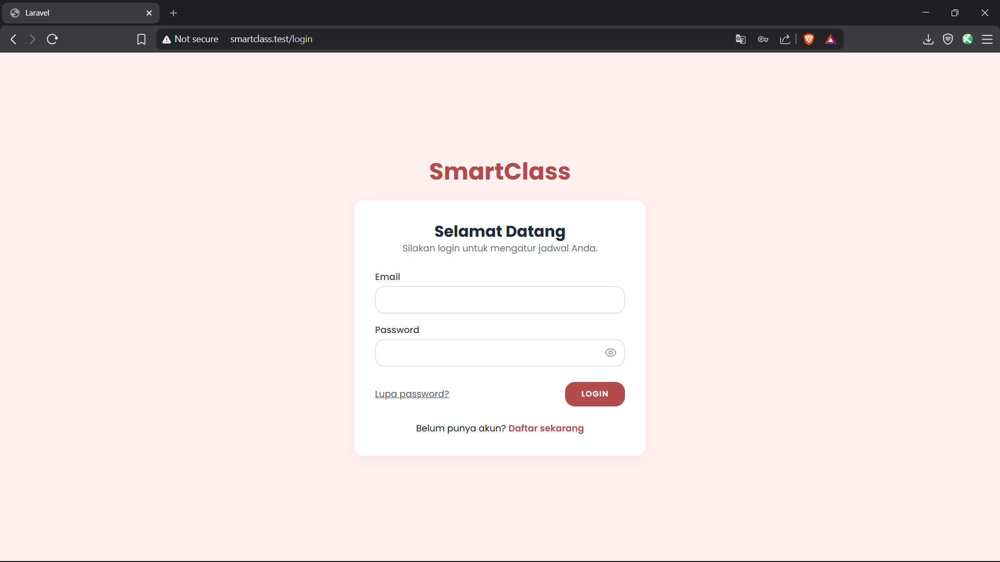 | 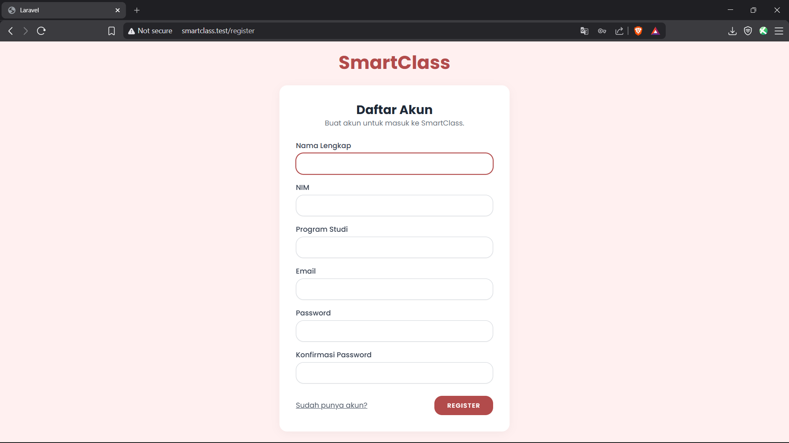 |

| Verifikasi Email | Log Email (Mailtrap/Log Driver) |
|---|---|
| 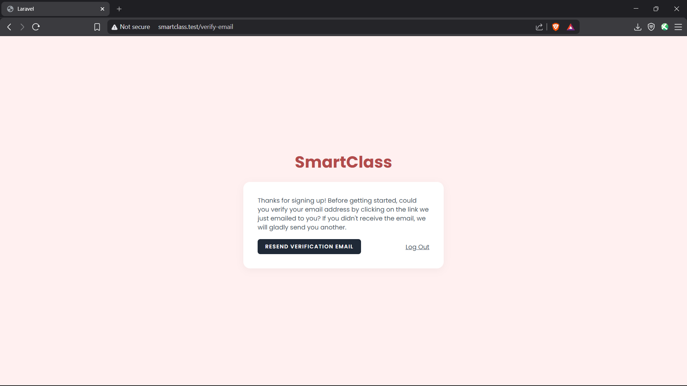 | 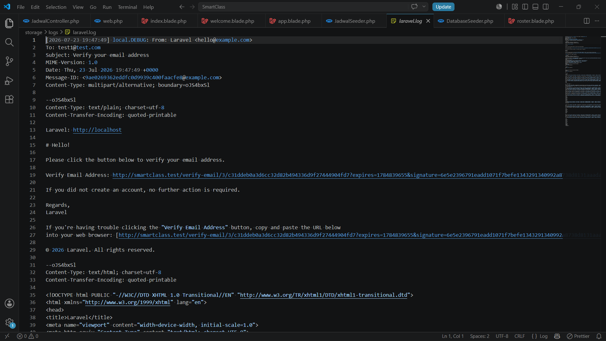 |

### 2. Dashboard

| Dashboard Admin | Dashboard User |
|---|---|
| 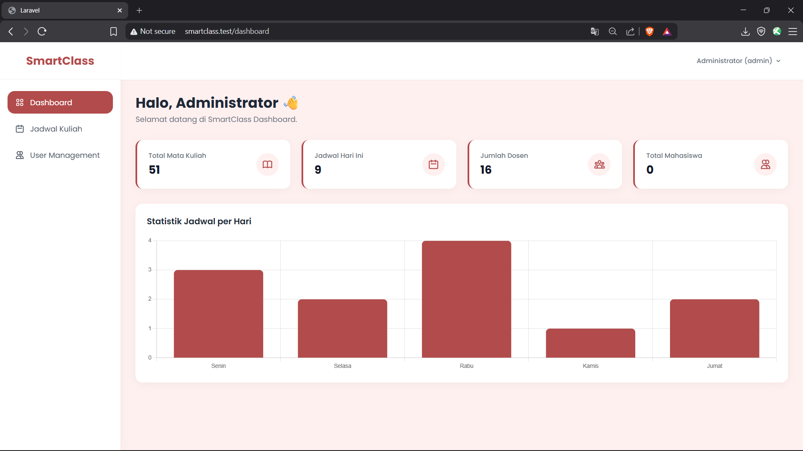 | 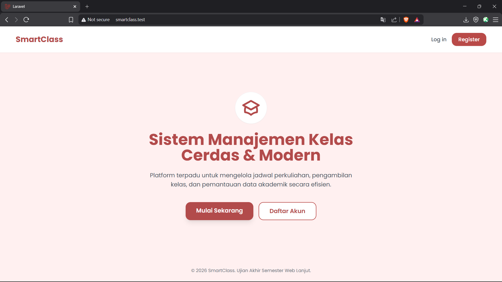 |

### 3. CRUD & Pemisahan Hak Akses (Admin vs User)

| Kelola Jadwal (Admin) | Lihat Jadwal (User) |
|---|---|
| 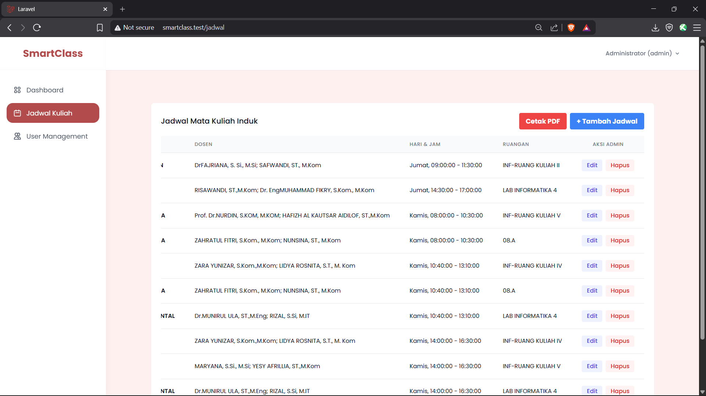 | 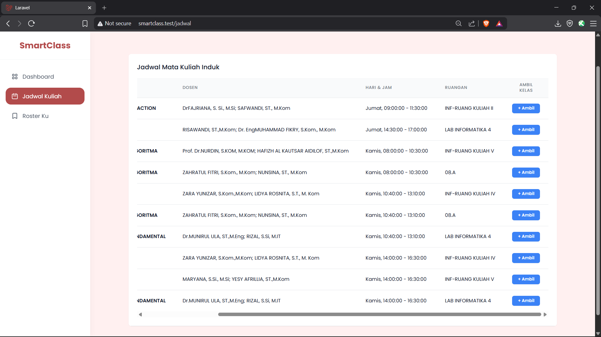 |

**Roster Mahasiswa (Enroll/Drop):**

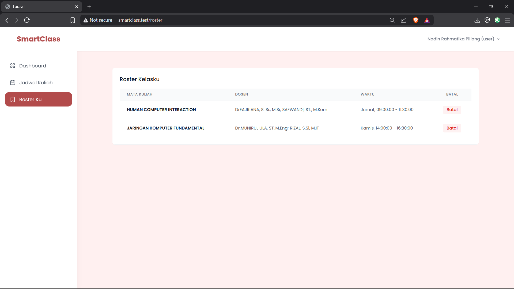

### 4. REST API (Pengujian Postman)

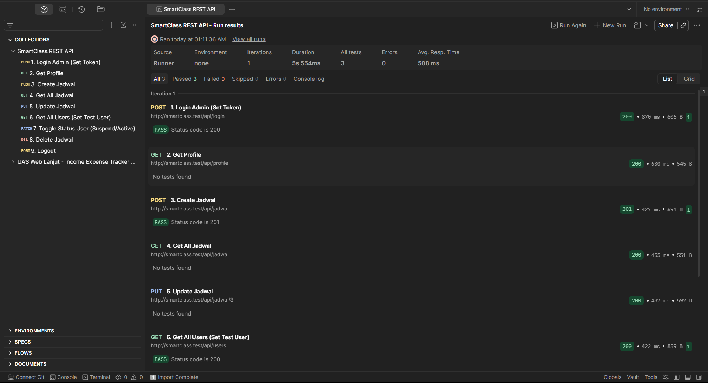

### 5. Tampilan Responsive (Mobile)

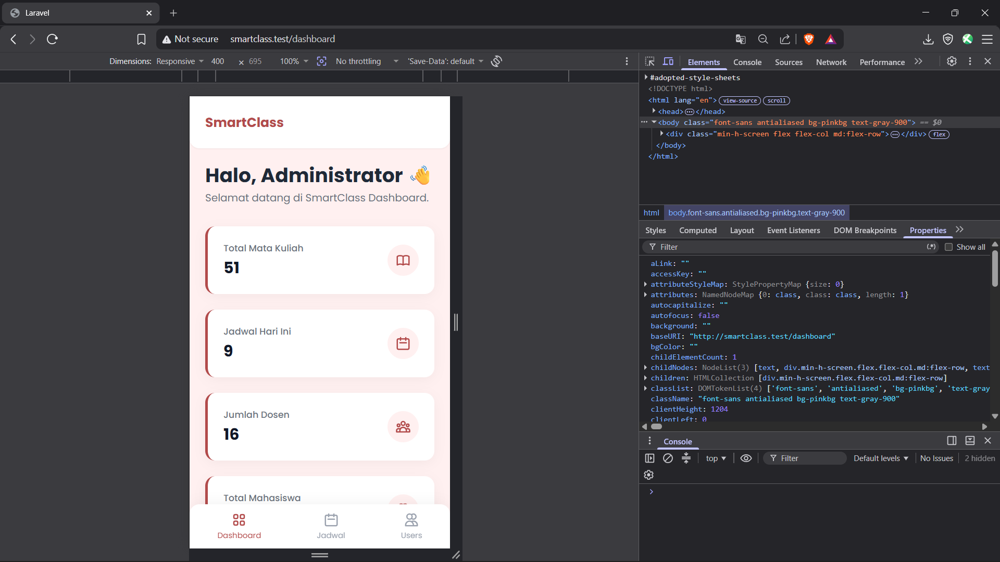

### 6. Export Laporan PDF

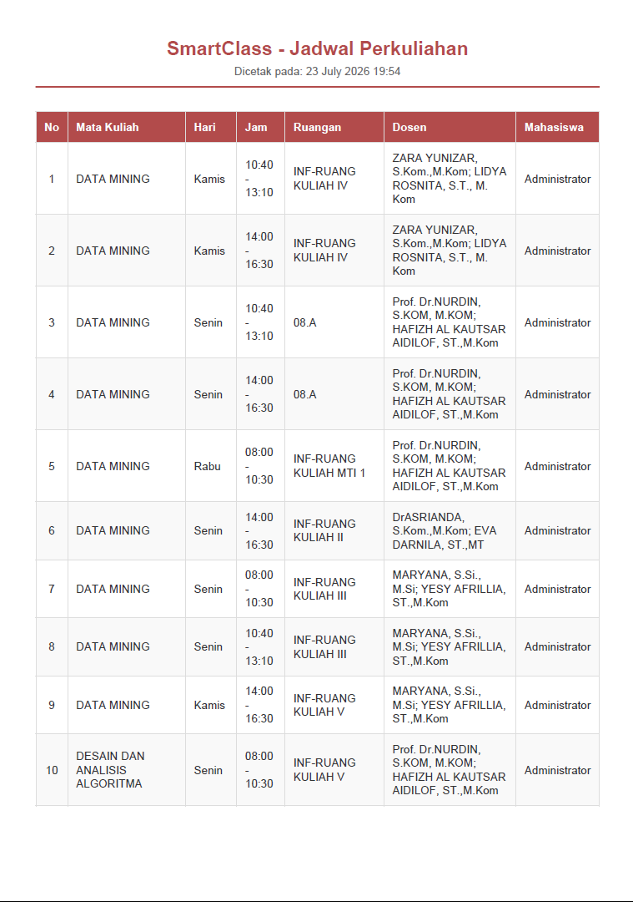

---

## REST API

Base URL: `http://localhost:8000/api`

Autentikasi menggunakan **Laravel Sanctum** (Bearer Token). Alur pengujian lengkap terdokumentasi pada koleksi Postman (lihat screenshot di atas).

| Method | Endpoint | Akses | Keterangan |
|---|---|---|---|
| POST | `/api/login` | Public | Login, mengembalikan token |
| POST | `/api/logout` | Auth | Logout, menghapus token aktif |
| GET | `/api/profile` | Auth | Data profil user yang sedang login |
| GET | `/api/jadwal` | Auth | Daftar seluruh jadwal kuliah |
| GET | `/api/jadwal/{id}` | Auth | Detail satu jadwal kuliah |
| POST | `/api/jadwal` | Admin | Tambah jadwal kuliah |
| PUT | `/api/jadwal/{id}` | Admin | Ubah jadwal kuliah |
| DELETE | `/api/jadwal/{id}` | Admin | Hapus jadwal kuliah |
| GET | `/api/users` | Admin | Daftar seluruh user |
| PUT | `/api/users/{id}` | Admin | Ubah data user |
| PATCH | `/api/users/{id}/toggle-status` | Admin | Suspend/aktifkan user |
| DELETE | `/api/users/{id}` | Admin | Hapus user |

**Contoh request login:**
```bash
curl -X POST http://localhost:8000/api/login \
  -H "Content-Type: application/json" \
  -d '{"email":"admin@smartclass.com","password":"password123"}'
```

**Contoh request dengan token:**
```bash
curl -X GET http://localhost:8000/api/jadwal \
  -H "Authorization: Bearer <TOKEN>"
```

---

## Struktur Hak Akses (Role)

| Halaman/Fitur | Admin | User |
|---|:---:|:---:|
| Dashboard | ✅ | ✅ |
| Lihat Jadwal Kuliah | ✅ | ✅ |
| Tambah/Ubah/Hapus Jadwal | ✅ | ❌ |
| Roster (Enroll/Drop) | ❌ | ✅ |
| Kelola Data User | ✅ | ❌ |
| Suspend/Aktifkan User | ✅ | ❌ |
| Export Laporan PDF | ✅ | ❌ |
| Kelola Profil Sendiri | ✅ | ✅ |

Pembatasan akses diterapkan melalui `RoleMiddleware` (`role:admin`) pada `routes/web.php` dan `routes/api.php`.

---

## Lisensi

Proyek ini dibuat untuk keperluan akademik (Ujian Akhir Semester — Pemrograman Web Lanjut, Universitas Malikussaleh).